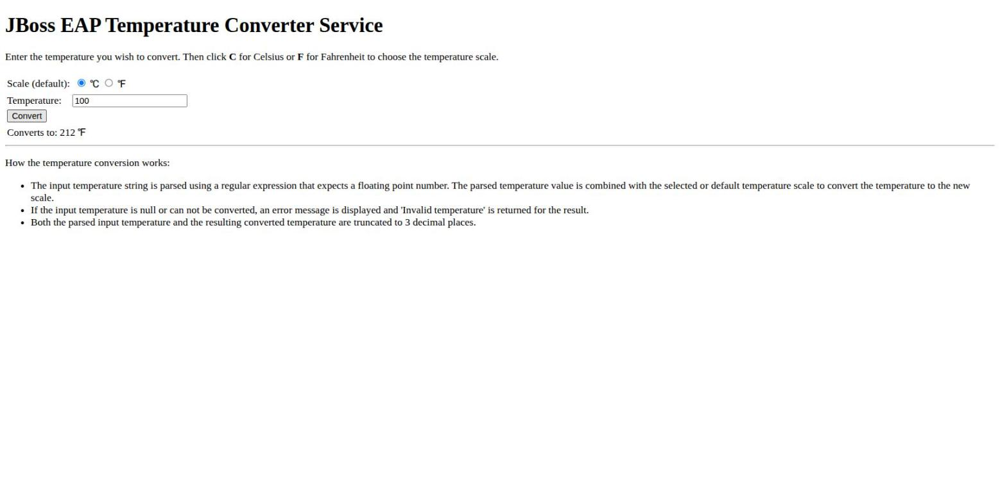
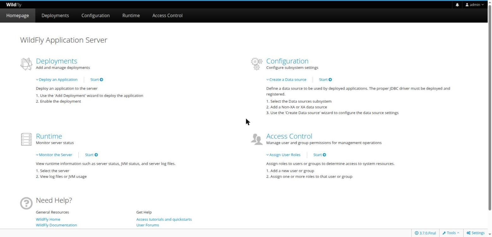
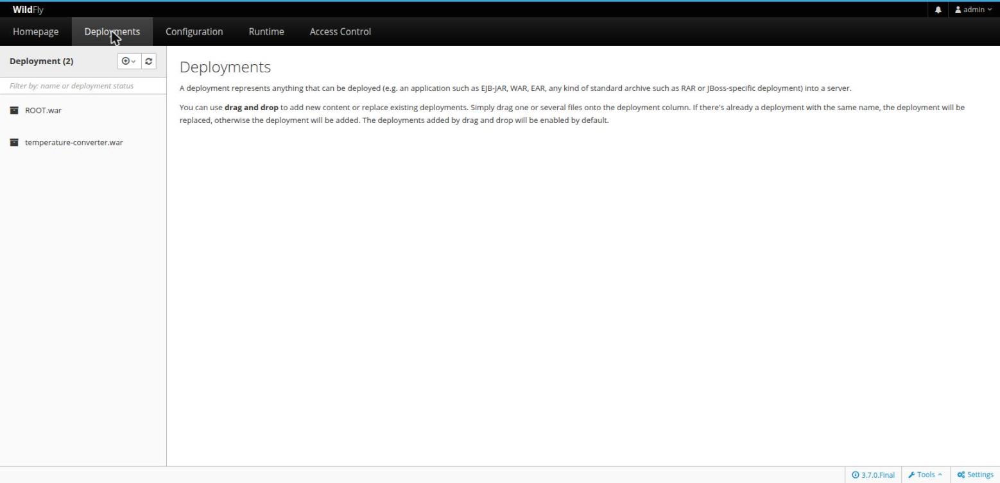

# wildfly-sle-bci

[](https://github.com/doccaz/wildfly-sle-bci/actions/workflows/build.yml)
[](LICENSE)

WildFly 32.0.0.Final packaged on SUSE's dedicated **SLE BCI OpenJDK** base
image, adapted from [`ericosuse/wildfly-demo`](https://hub.docker.com/r/ericosuse/wildfly-demo).

## What this is

The original `ericosuse/wildfly-demo` image was built on the generic
`registry.suse.com/suse/sle15:15.5` base image, with `java-17-openjdk`
installed by hand via `zypper`. This version instead builds on
`registry.suse.com/bci/openjdk:21` — SUSE's purpose-built BCI image that
already ships a supported OpenJDK runtime — and layers WildFly on top of it.

Everything else about the original image is preserved:

- WildFly `32.0.0.Final`, installed at `/opt/wildfly`
- Runs as the unprivileged `wildfly` user (uid/gid `101`), never root
- Two sample WAR deployments: `ROOT.war` and `temperature-converter.war`
  (the classic JBoss/WildFly Celsius↔Fahrenheit JSF+EJB quickstart)
- Ports `8080` (HTTP) and `9990` (management) exposed
- Same startup command (`standalone.sh -b 0.0.0.0 -bmanagement 0.0.0.0`)

### Why Java 21, not `openjdk:latest`

`registry.suse.com/bci/openjdk:latest` currently tracks Java 25. JDK 24+
removed the legacy `java.security.Policy` API, and WildFly 32's
`jboss-modules` bootstrap still calls `Policy.setPolicy()` — so the server
crashes immediately with `UnsupportedOperationException` on Java 25. Java 21
is the newest BCI OpenJDK LTS tag WildFly 32 actually boots on, so the
Dockerfile pins to `registry.suse.com/bci/openjdk:21` instead of `:latest`.

## Layout

```
Dockerfile              # image definition
deployments/            # WAR files copied into the image at build time
  ROOT.war
  temperature-converter.war
screenshots/            # for this README
```

## Pulling the pre-built image

Every push to `main` is built and published to GitHub Container Registry by
[`.github/workflows/build.yml`](.github/workflows/build.yml):

```bash
podman pull ghcr.io/doccaz/wildfly-sle-bci:latest
```

Tagged releases (`vX.Y.Z`) also publish `X.Y.Z` and `X.Y` tags; every build
is additionally tagged with its commit SHA.

## Building locally

```bash
podman build -t wildfly-sle-bci:latest .
```

This downloads the WildFly 32.0.0.Final tarball from GitHub at build time,
so it needs network access during `podman build`.

## Running

```bash
podman run -d --name wildfly \
  -p 8080:8080 -p 9990:9990 \
  wildfly-sle-bci:latest
```

Give it a few seconds to boot, then check the logs:

```bash
podman logs -f wildfly
```

You should see `WFLYSRV0025: WildFly Full 32.0.0.Final ... started`.

### Trying the sample app

Both `/` (`ROOT.war`) and `/temperature-converter/` serve the same
Celsius↔Fahrenheit converter (a JSF page backed by a stateless EJB).

Open http://localhost:8080/temperature-converter/ in a browser, enter a
temperature, and click **Convert**:



### Using the management console

The management console listens on port `9990`. By default there are no
management users configured, so you need to create one before logging in —
same as stock WildFly, this isn't specific to this image:

```bash
podman exec -it wildfly /opt/wildfly/bin/add-user.sh -u admin -p 'ChangeMe123!' -e
```

(`-e` marks it as an admin user with full management access.)

Then open http://localhost:9990 in a browser. WildFly's management interface
uses HTTP authentication, so **the browser will show its own native
login popup** (not an in-page form) — enter the username/password you just
created there:



The **Deployments** tab confirms both sample WARs are deployed and enabled:



Management users are stored in
`/opt/wildfly/standalone/configuration/mgmt-users.properties` inside the
container and are **not persisted** across `podman run`s unless you mount
that file (or the whole `standalone/configuration` directory) as a volume.

## Updating

### Bumping the WildFly version

Edit the `WILDFLY_VERSION` environment variable in the `Dockerfile` and rebuild:

```dockerfile
ENV WILDFLY_VERSION=32.0.0.Final \
```

Check the [WildFly releases page](https://www.wildfly.org/downloads/) for
available versions, and verify Java compatibility before bumping — see the
Java version note below.

### Bumping the Java version

Change the base image tag:

```dockerfile
FROM registry.suse.com/bci/openjdk:21
```

Available BCI OpenJDK tags can be pulled directly, e.g.
`registry.suse.com/bci/openjdk:17`, `:21`, `:25`. **Before switching**,
confirm the target WildFly version actually supports that JDK — newer
WildFly releases (33+) are more likely to support newer JDKs. If you bump to
`:latest`/`:25`, you'll likely need a newer WildFly release than 32.0.0.Final
to avoid the `Policy.setPolicy()` crash described above.

### Replacing the sample deployments

Drop your own `.war`/`.ear`/`.jar` files into `deployments/` (replacing or
adding to the existing ones) and rebuild — the Dockerfile copies everything
in that directory into `/opt/wildfly/standalone/deployments/`.

### Rebasing on a newer SLE BCI point release

SUSE periodically republishes the `openjdk:21` tag against newer SLE Service
Packs. Just re-pull and rebuild:

```bash
podman pull registry.suse.com/bci/openjdk:21
podman build --pull -t wildfly-sle-bci:latest .
```

## Verified

- Image builds cleanly on top of `registry.suse.com/bci/openjdk:21`
- Server boots and both WARs deploy successfully
- `wildfly` process runs as uid/gid `101`, not root
- `/` and `/temperature-converter/` both return HTTP 200 and the conversion
  logic works end to end (100 °C → 212 °F, exercising Undertow, JSF/Mojarra,
  Weld/CDI, and the EJB layer)
- Management console reachable on `:9990`, authenticates via HTTP auth, and
  correctly lists both deployments

## CI/CD

[`.github/workflows/build.yml`](.github/workflows/build.yml) builds the
image and pushes it to `ghcr.io/doccaz/wildfly-sle-bci` on every push to
`main`, on version tags (`v*.*.*`), and on manual dispatch; pull requests
build but don't push. The workflow uses the repo's own `GITHUB_TOKEN`, so no
extra secrets are needed.

**One-time setup:** GHCR packages pushed via `GITHUB_TOKEN` are created
private by default. After the first successful workflow run, make the
package public from its GitHub settings page
(`github.com/doccaz/wildfly-sle-bci/pkgs/container/wildfly-sle-bci` →
**Package settings** → **Change visibility**) so `podman pull`/`docker pull`
work without authentication.

## License

Licensed under the [GNU General Public License v3.0](LICENSE).
